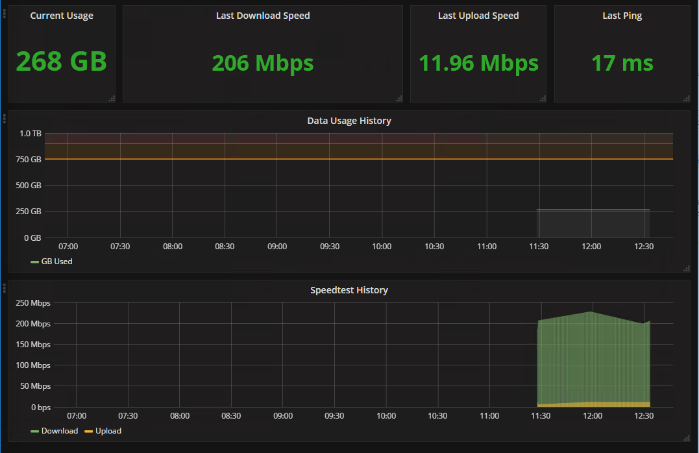

# Docker-Comcast-Stats
A docker container tracking Comcast data usage and speed

# What it is
This page aggregates two different projects: [Speedtest for InfluxDB](https://github.com/barrycarey/Speedtest-for-InfluxDB-and-Grafana) and  [comcastUsage for influxdb](https://github.com/billimek/comcastUsage-for-influxdb)



# How to use it

## Running the container
* Make sure docker-compose is installed
* Clone this repository
* Edit the comcastUsage.ini and speedtest.ini files at the root of the folder
* docker-compose up -d

## Displaying data (optional)
**NOTE** These are instructions to do this manually, if you'd prefer not to use the included grafana data folder

Set datasources:
* Open Browser to (dockerhost):3235
* Left menu, sign in
* Sign in using grafana default credentials (admin/admin)
* Add data sources below


```
Data Source Name: comcast
Name: comcast
Type: InfluxDB 
URL: http://influxdb:8086
Database: comcast 

Data Source Name: speedtest
Type: InfluxDB 
URL: http://influxdb:8086
Database: speedtests 
```

* Menu, Dashboards, Import
* Paste in content of the example-dashboard.json
* Select the correct DBs for comcast and speedtest

